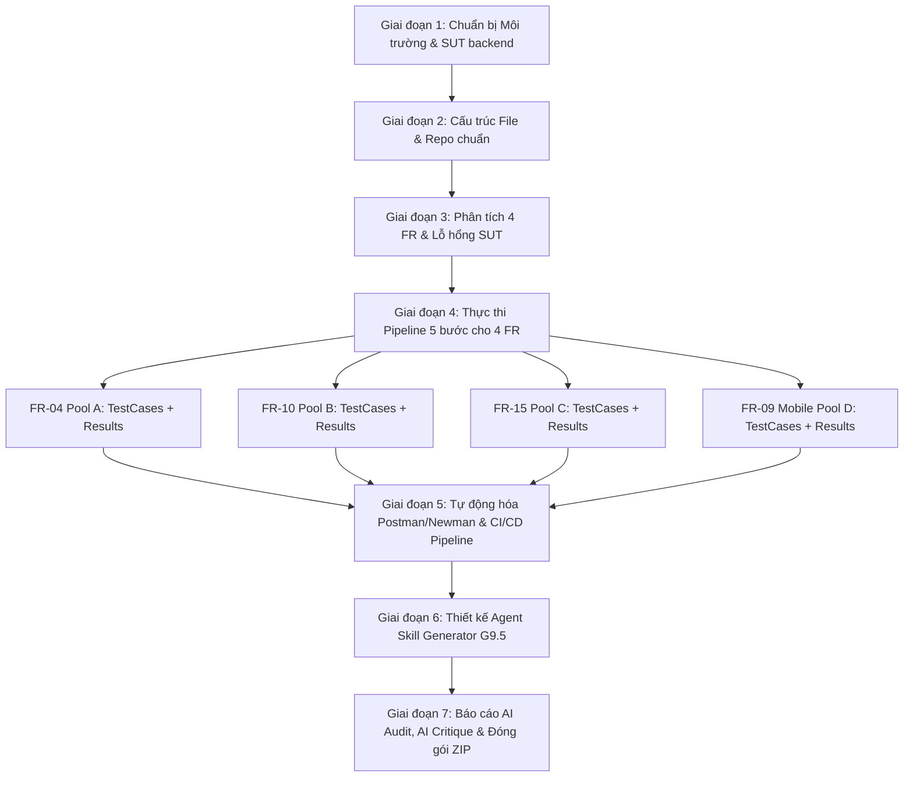

# HƯỚNG DẪN TOÀN DIỆN, KẾ HOẠCH TRIỂN KHAI & BỘ PROMPT CHUYÊN SÂU
# BÀI TẬP HW06: API TESTING VỚI AI & POSTMAN/NEWMAN (EShop SUT)
## BỘ 4 CHỨC NĂNG (POOLS A, B, C, D): FR-04, FR-09 (MOBILE), FR-10, FR-15

> **Mã bài tập:** HW06-AI | **Thời lượng:** ~10 giờ | **Hình thức:** Cá nhân  
> **SUT:** EShop Backend (`http://localhost:3000`) | **Repository:** `https://github.com/ttbhanh/eshop-sut`  
> **Cấp độ Bloom-AI mục tiêu:** G9.2 (Apply) ➔ G9.3 (Analyse) ➔ G9.4 (Collaborate) ➔ G9.5 (Create)  
> **Quy chuẩn tên file nộp:** `<StudentID>_HW06_AI_API_<SelfAssessedGrade>.zip` *(Ví dụ: `25127001_HW06_AI_API_100.zip`)*  
> **Bộ 4 tính năng thực hiện:**  
> 1. **FR-04 (Pool A):** Quản lý Hồ sơ Cá nhân (`PUT /api/users/me` & `GET /api/users/me`)  
> 2. **FR-10 (Pool B):** Máy Trạng thái & Hủy Đơn hàng (`PUT /api/orders/:id/cancel`)  
> 3. **FR-15 (Pool C):** Quản lý Sản phẩm Admin CRUD (`POST/PUT/DELETE /api/products`)  
> 4. **FR-09 (Pool D / Mobile):** Áp dụng Mã Giảm Giá Mobile Flow (`POST /api/apply-coupon`)

---

## MỤC LỤC
1. [TỔNG HỢP YÊU CẦU & MA TRẬN 4 POOL / 4 FR](#1-tổng-hợp-yêu-cầu--ma-trận-4-pool--4-fr)
2. [CHI TIẾT KẾ HOẠCH TRIỂN KHAI CHO 4 FR](#2-chi-tiết-kế-hoạch-triển-khai-cho-4-fr)
   - [Giai đoạn 1: Chuẩn bị Môi trường & Khởi chạy SUT](#giai-đoạn-1-chuẩn-bị-môi-trường--khởi-chạy-sut)
   - [Giai đoạn 2: Cấu trúc File & Thư mục Chuẩn](#giai-đoạn-2-cấu-trúc-file--thư-mục-chuẩn)
   - [Giai đoạn 3: Phân tích Lỗ hổng & Đặc tả Kỹ thuật của 4 FR](#giai-đoạn-3-phân-tích-lỗ-hổng--đặc-tả-kỹ-thuật-của-4-fr)
   - [Giai đoạn 4: Quy trình 5 bước thực thi cho từng FR](#giai-đoạn-4-quy-trình-5-bước-thực-thi-cho-từng-fr)
   - [Giai đoạn 5: Tích hợp CI/CD Pipeline (GitHub Actions)](#giai-đoạn-5-tích-hợp-cicd-pipeline-github-actions)
   - [Giai đoạn 6: Thiết kế & Xây dựng Agent Skill (G9.5 - 10đ)](#giai-đoạn-6-thiết-kế--xây-dựng-agent-skill-g95---10đ)
   - [Giai đoạn 7: Báo cáo AI Audit, AI Critique & Đóng gói Nộp bài](#giai-đoạn-7-báo-cáo-ai-audit-ai-critique--đóng-gói-nộp-bài)
3. [BỘ PROMPT CHUYÊN SÂU CHO TỪNG FR & TỪNG KỸ THUẬT](#3-bộ-prompt-chuyên-sâu-cho-từng-fr--từng-kỹ-thuật)
   - [Prompt 0: Thiết lập Vai trò & Định vị Chuyên gia Kiểm thử API](#prompt-0-thiết-lập-vai-trò--định-vị-chuyên-gia-kiểm-thử-api)
   - [Prompt May đo 1: Sinh Test Cases cho FR-04 (Pool A - Profile Management)](#prompt-may-đo-1-sinh-test-cases-cho-fr-04-pool-a---profile-management)
   - [Prompt May đo 2: Sinh Test Cases cho FR-10 (Pool B - Order State Machine)](#prompt-may-đo-2-sinh-test-cases-cho-fr-10-pool-b---order-state-machine)
   - [Prompt May đo 3: Sinh Test Cases cho FR-15 (Pool C - Admin Product CRUD)](#prompt-may-đo-3-sinh-test-cases-cho-fr-15-pool-c---admin-product-crud)
   - [Prompt May đo 4: Sinh Test Cases cho FR-09 (Pool D / Mobile - Apply Coupon)](#prompt-may-đo-4-sinh-test-cases-cho-fr-09-pool-d--mobile---apply-coupon)
   - [Prompt Audit: Đánh giá Tính hợp lệ (Valid / Invalid / Incomplete)](#prompt-audit-đánh-giá-tính-hợp-lệ-valid--invalid--incomplete)
   - [Prompt Extension: Tìm ca kiểm thử nâng cao AI bỏ sót (≥ 5 TCs/FR)](#prompt-extension-tìm-ca-kiểm-thử-nâng-cao-ai-bỏ-sót--5-tcsfr)
   - [Prompt Agent Skill: Thiết kế AI-Driven Test Generator (Mức G9.5)](#prompt-agent-skill-thiết-kế-ai-driven-test-generator-mức-g95)
4. [KHO MẪU CODE & SCRIPTS SẴN DÙNG (READY-TO-USE CODE SNIPPETS)](#4-kho-mẫu-code--scripts-sẵn-dùng)
   - [Postman Pre-request Script (Tự động chèn X-Student-Id & JWT)](#postman-pre-request-script-tự-động-chèn-x-student-id--jwt)
   - [Postman Test Scripts Mẫu cho từng FR](#postman-test-scripts-mẫu-cho-từng-fr)
   - [GitHub Actions Workflow (`.github/workflows/api-tests.yml`)](#github-actions-workflow-githubworkflowsapi-testsyml)
   - [Mã nguồn Python Agent Skill Generator mẫu (`generator/api_test_agent.py`)](#mã-nguồn-python-agent-skill-generator-mẫu-generatorapi_test_agentpy)
   - [Mẫu AI Critique Chuẩn (200 - 300 từ)](#mẫu-ai-critique-chuẩn-200---300-từ)
5. [CHECKLIST KIỂM TRA TRƯỚC KHI NỘP BÀI](#5-checklist-kiểm-tra-trước-khi-nộp-bài)

---

## 1. TỔNG HỢP YÊU CẦU & MA TRẬN 4 POOL / 4 FR

### 1.1 Mục tiêu & Thang đo Bloom-AI
* **G9.2 (Apply):** Sử dụng AI để sinh test cases từ đặc tả API theo các kỹ thuật chuẩn (Phân vùng tương đương EP, Phân tích giá trị biên BVA, Máy chuyển trạng thái, Bảo mật SEC-01 đến SEC-07, JSON Schema).
* **G9.3 (Analyse):** Thực hiện Human Audit (gán nhãn VALID / INVALID / INCOMPLETE kèm giải thích), phân tích kết quả chạy Postman/Newman và phân loại bug trong source code `server.js`.
* **G9.4 (Collaborate):** Mở rộng test suite bằng các ca kiểm thử tự thiết kế (ít nhất 5 TC/FR mà AI bỏ sót), phân tích nguyên nhân AI thiếu sót (hạn chế mô hình, prompt chưa đủ sâu, logic ngầm của SUT).
* **G9.5 (Create):** Tự thiết kế hệ thống **AI-Driven API Test Generator** (sơ đồ tự vẽ + mã giả/code thực thi + Agent Skill).

### 1.2 Bảng Ma trận 4 Chức năng (FR) theo 4 Pool

| STT | Mã FR | Tên Chức năng | Pool | Endpoint & HTTP Method | Quyền hạn (Auth/Role) | File Test Cases & Kết quả tương ứng |
| :---: | :---: | :--- | :---: | :--- | :--- | :--- |
| **1** | **FR-04** | **Quản lý Hồ sơ Cá nhân** | **Pool A** *(Auth & Users)* | `PUT /api/users/me`<br>`GET /api/users/me` | `Bearer <token>`<br>(User) | • `FR04_TestCases.md`<br>• `FR04_TestExecution_Results.md` |
| **2** | **FR-10** | **Máy Trạng thái & Hủy Đơn** | **Pool B** *(Cart & Orders)* | `PUT /api/orders/:id/cancel` | `Bearer <token>`<br>(User / Owner) | • `FR10_TestCases.md`<br>• `FR10_TestExecution_Results.md` |
| **3** | **FR-15** | **Quản lý Sản phẩm Admin** | **Pool C** *(Web Admin)* | `POST /api/products`<br>`PUT /api/products/:id`<br>`DELETE /api/products/:id` | `role = 'admin'` | • `FR15_TestCases.md`<br>• `FR15_TestExecution_Results.md` |
| **4** | **FR-09** | **Áp dụng Mã Giảm Giá** | **Pool D** *(Mobile Flow)* /<br>**Pool B** *(Coupons)* | `POST /api/apply-coupon` | Public / User | • `FR09_Mobile_TestCases.md`<br>• `FR09_TestExecution_Results.md` |

### 1.3 Quy tắc Bắt buộc & Chống gian lận (Anti-AI-Cheat Constraints)
1. **Header `X-Student-Id`:** Tất cả request gửi qua Postman/Newman bắt buộc phải có header `X-Student-Id: {StudentID}` được sinh từ Pre-request Script. Bắt buộc có ảnh chụp Postman Console chứng minh.
2. **Newman Hostname:** Báo cáo Newman HTML phải chứng minh chạy trên máy local (`localhost:3000` hoặc `127.0.0.1:3000`), không được làm giả kết quả.
3. **Sơ đồ Agent Skill:** Phải là **Self-drawn Diagram** (sinh viên tự thiết kế kiến trúc bằng công cụ như Draw.io, Excalidraw, Miro hoặc Mermaid thủ công; không dùng hình ảnh do AI render dạng ảnh hoàn chỉnh không có bản quyền tư duy).
4. **Git Commit Granular:** Commit riêng biệt cho từng bước (Generation, Audit, Extension, Execution, Bug Report) và xuất ra file `git_commit_log.txt`.
5. **Chính sách AI:** Đính kèm đầy đủ `AI Audit Report` (chi tiết từng Prompt & Output) và `AI Critique` (200–300 từ).

---

## 2. CHI TIẾT KẾ HOẠCH TRIỂN KHAI CHO 4 FR



### Giai đoạn 1: Chuẩn bị Môi trường & Khởi chạy SUT
1. **Khởi động backend EShop:**
   - Thư mục: `HW06/eshop-sut/backend`
   - Cài đặt thư viện: `npm install`
   - Khởi tạo CSDL SQLite: `node database.js`
   - Khởi động server: `node server.js` (Lắng nghe tại `http://localhost:3000`)
2. **Kiểm tra hoạt động:** Gửi request thử nghiệm `GET http://localhost:3000/api/products` xác nhận HTTP 200 OK.

---

### Giai đoạn 2: Cấu trúc File & Thư mục Chuẩn
Tổ chức các file bài làm đồng bộ với cấu trúc file markdown bạn đã lập trong repository:

```text
HW06_Submission/
├── FR04_TestCases.md               # Bộ Test Cases (>=35 TCs + Audit + Extend) cho FR-04
├── FR04_TestExecution_Results.md   # Kết quả chạy Postman/Newman + Bug Report FR-04
├── FR09_Mobile_TestCases.md        # Bộ Test Cases (>=35 TCs + Audit + Extend) cho FR-09 Mobile
├── FR09_TestExecution_Results.md   # Kết quả chạy Postman/Newman + Bug Report FR-09 Mobile
├── FR10_TestCases.md               # Bộ Test Cases (>=35 TCs + Audit + Extend) cho FR-10
├── FR10_TestExecution_Results.md   # Kết quả chạy Postman/Newman + Bug Report FR-10
├── FR15_TestCases.md               # Bộ Test Cases (>=35 TCs + Audit + Extend) cho FR-15
├── FR15_TestExecution_Results.md   # Kết quả chạy Postman/Newman + Bug Report FR-15
├── collections/
│   ├── FR04_Profile_TestSuite.postman_collection.json
│   ├── FR09_Coupon_TestSuite.postman_collection.json
│   ├── FR10_OrderCancel_TestSuite.postman_collection.json
│   ├── FR15_ProductCRUD_TestSuite.postman_collection.json
│   ├── HW06_EShop_Master_Collection.json
│   └── EShop_Local.postman_environment.json
├── data/                           # File CSV/JSON cho Data-driven testing
│   ├── coupon_test_data.json
│   └── login_test_data.csv
├── reports/                        # Newman HTML reports & Screenshots
│   ├── Newman_Report_FR04.html
│   ├── Newman_Report_FR09_Mobile.html
│   ├── Newman_Report_FR10.html
│   ├── Newman_Report_FR15.html
│   └── Newman_Report_Full_Suite.html
├── ci-cd/                          # CI/CD report & workflow file
│   ├── ci_cd_report.md
│   └── .github/workflows/api-tests.yml
├── generator/                      # Agent skill design, diagram & script
│   ├── agent_architecture_diagram.png (hoặc .mmd)
│   ├── api_test_agent.py
│   └── generator_design_doc.md
├── test-cases/
│   └── HW06_API_TestCases_Master.xlsx
├── main_report.md                  # Báo cáo chính thức tổng hợp 4 FR
├── ai_audit_report.md              # Nhật ký Prompt & Output AI chi tiết
├── ai_critique.md                  # Đoạn văn phản biện AI (200 - 300 từ)
├── git_commit_log.txt              # Lịch sử Git commit từng bước
└── README.md                       # Bảng tự đánh giá & Test Summary Report
```

---

### Giai đoạn 3: Phân tích Lỗ hổng & Đặc tả Kỹ thuật của 4 FR

Dưới đây là chi tiết mã nguồn `eshop-sut/backend/server.js` và các lỗi nghiêm trọng tương ứng của 4 FR:

| Mã FR | Endpoint & Method | Phân tích Mã nguồn Backend (`server.js`) | Lỗ hổng / Bug thực tế cần bắt |
| :--- | :--- | :--- | :--- |
| **FR-04**<br>*(Pool A)* | `PUT /api/users/me`<br>`GET /api/users/me` | Trong `server.js` (dòng 124-127):<br>```javascript\napp.put('/api/users/me', authenticateToken, (req, res) => {\n  const { name, shipping_address, phone, role } = req.body;\n  db.run(`UPDATE users SET name = ?, shipping_address = ?, phone = ?, role = COALESCE(?, role) WHERE id = ?`, ...)\n})\n``` | 1. **Lỗ hổng nghiêm trọng SEC-06 (Privilege Escalation via Mass Assignment):** Cho phép user thường truyền `{"role": "admin"}` để tự nâng quyền quản trị!<br>2. **Thiếu validation số điện thoại:** Không kiểm tra định dạng bắt đầu bằng '0', độ dài 10-11 số.<br>3. Không bảo vệ trường `email` nếu bị chèn vào câu UPDATE. |
| **FR-10**<br>*(Pool B)* | `PUT /api/orders/:id/cancel`<br>`GET /api/orders/:id` | Trong `server.js` (dòng 328-335):<br>```javascript\nif (order.status === 'delivered' || order.status === 'canceled') {\n  return res.status(400).json({ error: 'Cannot cancel order in this status' });\n}\n// Không chặn trạng thái 'shipping'!\n``` | 1. **Vi phạm State Transition (FR-10 & FR-20):** Cho phép user hủy đơn khi trạng thái đang là `shipping` (trái đặc tả SRS: đang giao hàng thì user không được hủy).<br>2. **Lỗ hổng BOLA/IDOR trên `GET /api/orders/:id`:** Không có middleware xác thực, ai cũng xem được thông tin đơn của người khác.<br>3. Thiếu kiểm tra quyền sở hữu đơn khi hủy (User A có thể hủy đơn của User B nếu không check `user_id`). |
| **FR-15**<br>*(Pool C)* | `POST /api/products`<br>`PUT /api/products/:id`<br>`DELETE /api/products/:id` | Trong `server.js` (dòng 167, 179, 191):<br>```javascript\napp.post('/api/products', (req, res) => { ... }) // THIẾU authenticateToken!\napp.put('/api/products/:id', (req, res) => { ... }) // THIẾU authenticateToken!\napp.delete('/api/products/:id', (req, res) => { ... }) // THIẾU authenticateToken!\n``` | 1. **Lỗ hổng nghiêm trọng SEC-03 & FR-12 (Broken Access Control):** Cả 3 route Admin **HOÀN TOÀN KHÔNG CÓ** middleware `authenticateToken`! Khách vãng lai không cần đăng nhập vẫn Thêm/Sửa/Xóa sản phẩm được.<br>2. **Không validate Domain:** Chấp nhận giá `price <= 0` hoặc âm, tên `name` rỗng.<br>3. **Bug ép kiểu (Type Coercion):** `GET /api/products/:id` ép giá thành `string` ở các sản phẩm có ID chẵn (`price.toString()`). |
| **FR-09**<br>*(Pool D / Mobile)* | `POST /api/apply-coupon` | Trong `server.js` (dòng 398-406):<br>```javascript\nif (coupon.type === 'percent') {\n  discount_amount = Math.floor(total_amount * (1 - coupon.discount_value));\n  final_amount = total_amount - discount_amount;\n}\n``` | 1. **Lỗi công thức toán học nghiêm trọng (Math Bug):** Thay vì tính `total_amount * (discount_value / 100)`, code lại tính `total_amount * (1 - discount_value)`. Với discount_value = 10, kết quả ra số âm khổng lồ (-9 lần tổng tiền)!<br>2. **Lỗi so sánh ngưỡng đơn hàng:** Code dùng `total_amount > coupon.min_order_amount` thay vì `>=` (đơn hàng bằng đúng ngưỡng bị từ chối sai). |

---

### Giai đoạn 4: Quy trình 5 bước thực thi cho từng FR

Thực hiện đồng nhất cho cả 4 file test cases (`FR04_TestCases.md`, `FR10_TestCases.md`, `FR15_TestCases.md`, `FR09_Mobile_TestCases.md`):

1. **Bước 1 - AI Generation (≥ 35 TCs / FR):**
   - Áp dụng các Prompt may đo trong Mục 3.
   - Bao phủ 4 nhóm: Domain Partitions (EP & BVA), State Transitions / Business Logic, Security (SEC-01 đến SEC-07), Schema & Status Codes.
2. **Bước 2 - Human Audit (Đánh giá từng TC):**
   - Đánh nhãn **VALID**, **INVALID**, **INCOMPLETE**.
   - Giải trình chuyên môn lý do tại sao đúng/sai so với tài liệu SRS.
   - Cung cấp phiên bản hiệu chỉnh (Correction) cho các ca bị sai.
3. **Bước 3 - Extension (≥ 5 TCs tự thiết kế / FR):**
   - Bổ sung tối thiểu 5 ca kiểm thử nâng cao mà AI bỏ sót (tập trung vào các bug ngầm trong mã nguồn `server.js`).
   - Phân tích rõ nguyên nhân AI bỏ sót (Prompt limitations, Model bias, Hidden source code nuances).
4. **Bước 4 - Execution (Postman + Newman):**
   - Tổ chức Collection trên Postman, cấu hình Pre-request Script tự động chèn `X-Student-Id: <MSSV>`.
   - Viết các test script kiểm tra Status code, Response time, JSON Schema, Business Logic assertions.
   - Chạy Newman xuất báo cáo HTML và chụp ảnh màn hình Postman Console.
5. **Bước 5 - Bug Reporting:**
   - Lập bảng mô tả bug chi tiết theo chuẩn ISTQB trong file `FRxx_TestExecution_Results.md`.
   - Tạo Issue trên GitHub repository kèm ảnh chụp màn hình bằng chứng.

---

### Giai đoạn 5: Tích hợp CI/CD Pipeline (GitHub Actions)

1. **Thiết lập GitHub Workflow:** Tạo `.github/workflows/api-tests.yml` tự động khởi động server backend EShop và chạy Newman khi có `git push` hoặc `pull_request`.
2. **Thực hiện 2 Mẫu Commit bắt buộc:**
   - **Commit A (Green - All Passed):** Điều chỉnh assertions hoặc chạy các test cases chuẩn ➔ Pipeline hiển thị tích xanh **Passed**.
   - **Commit B (Red - 1 Test Failing):** Kích hoạt test case bắt trúng bug thực tế của SUT (ví dụ: test case kỳ vọng API tính đúng công thức coupon, nhưng backend trả về số âm ➔ test fail) ➔ Pipeline hiển thị chữ thập đỏ **Failed**.
3. **Tạo tài liệu `ci-cd/ci_cd_report.md`:** Đính kèm link 2 commit và ảnh chụp màn hình GitHub Actions.

---

### Giai đoạn 6: Thiết kế & Xây dựng Agent Skill (G9.5 - 10đ)

1. **Kiến trúc Hệ thống (AI-Driven API Test Generator):**
   - **Sơ đồ tự vẽ (Self-drawn Architecture Diagram):** Vẽ pipeline gồm: *API Spec Parser ➔ Constraint Extractor ➔ Prompt Strategy Orchestrator ➔ Test Case & Chai Script Synthesizer ➔ Postman Collection Serializer ➔ Newman Runner & Self-Healing Loop*.
2. **Mã giả (Pseudocode):** Thuật toán tự động phân tích Markdown spec và sinh JSON Collection v2.1.
3. **Mã nguồn thực thi:** File Python `generator/api_test_agent.py` kết nối API LLM (Gemini/OpenAI/Claude) để sinh test cases tự động cho 1 endpoint.
4. **Demo Video (Khuyến khích):** Quay clip 2–3 phút chạy script và tải lên YouTube.

---

### Giai đoạn 7: Báo cáo AI Audit, AI Critique & Đóng gói Nộp bài

1. **Hoàn thiện AI Audit Report (`ai_audit_report.md`):** Ghi nhật ký từng phiên làm việc với AI (Công cụ, Thời gian, Prompt gửi đi, Output nhận về, Đánh giá của sinh viên).
2. **Hoàn thiện AI Critique (`ai_critique.md`):** Đoạn văn học thuật 200 – 300 từ phản biện về điểm yếu, thiên kiến và hạn chế của AI.
3. **Xuất Git Commit Log:** Chạy `git log --pretty=format:"%h - %an, %ar : %s" > git_commit_log.txt`.
4. **Đóng gói file ZIP:** Tên file `<StudentID>_HW06_AI_API_<Grade>.zip`.

---

## 3. BỘ PROMPT CHUYÊN SÂU CHO TỪNG FR & TỪNG KỸ THUẬT

### Prompt 0: Thiết lập Vai trò & Định vị Chuyên gia Kiểm thử API
*Chạy prompt này đầu tiên để định hình ngữ cảnh làm việc cho AI.*

```markdown
Bạn là một Chuyên gia Kiểm thử Phần mềm Cao cấp (Senior QA Automation Engineer & Security Tester) chuyên sâu về API Testing theo chuẩn quốc tế ISTQB và OWASP API Security Top 10.

Chúng ta đang thực hiện kiểm thử cho hệ thống E-commerce có tên "EShop" (Node.js/Express + SQLite).
Tài liệu Hệ thống và Yêu cầu Nghiệp vụ (SRS) cùng Tài liệu Đặc tả API (API Specification) đã được cung cấp.

Quy tắc làm việc:
1. Bạn phải tuân thủ nghiêm ngặt các kỹ thuật thiết kế test case chuẩn: Phân vùng tương đương (EP), Phân tích giá trị biên (BVA), Kiểm thử chuyển trạng thái (State Transition Testing), Kiểm thử bảo mật API (SEC-01 đến SEC-07), và JSON Schema Validation.
2. Với mỗi test case, bạn phải xuất ra bảng chuẩn gồm các cột:
   - TC_ID: [Mã định danh duy nhất, ví dụ: TC_FR04_EP_01]
   - Category: [Domain / State / Security / Schema]
   - Test Objective: [Mục tiêu kiểm thử cụ thể]
   - Pre-condition: [Điều kiện tiên quyết, dữ liệu seed]
   - Request Method & Endpoint: [VD: PUT /api/users/me]
   - Headers: [Content-Type, Authorization, X-Student-Id]
   - Request Body / Query Params: [Dữ liệu gửi lên dạng JSON/String]
   - Expected Status Code: [Mã HTTP kỳ vọng: 200, 400, 401, 403, 404]
   - Expected Response Body / JSON Schema: [Mô tả chi tiết payload trả về và các trường bắt buộc]
   - Postman Chai Assertion: [Đoạn mã test script kiểm tra tự động]

Hãy xác nhận bạn đã hiểu rõ vai trò và sẵn sàng tiếp nhận yêu cầu phân tích từng API.
```

---

### Prompt May đo 1: Sinh Test Cases cho FR-04 (Pool A - Profile Management)
*Dành cho file `FR04_TestCases.md` — Tập trung vào `PUT /api/users/me` & `GET /api/users/me`.*

```markdown
Bạn là Chuyên gia Kiểm thử API & Bảo mật. Hãy thiết kế bộ Test Suite toàn diện (tối thiểu 35 Test Cases) cho chức năng Quản lý Hồ sơ Cá nhân (FR-04):
- Endpoint: PUT /api/users/me & GET /api/users/me
- Header bắt buộc: Authorization: Bearer <token>, X-Student-Id: 25127001
- Request Body mẫu (JSON):
  {
    "name": "Nguyen Van A",
    "shipping_address": "123 Le Loi, Q1, TP.HCM",
    "phone": "0912345678"
  }

Đặc tả nghiệp vụ (SRS FR-04 & SEC-06):
1. Cập nhật thông tin cá nhân cơ bản: name, shipping_address, phone.
2. Ràng buộc số điện thoại: Phải bắt đầu bằng chữ số '0', độ dài 10 đến 11 chữ số.
3. Không được phép thay đổi Email qua API này.
4. Bảo mật SEC-06 (Privilege Escalation): Người dùng thường (role='user') KHÔNG ĐƯỢC PHÉP tự nâng quyền của mình lên 'admin' thông qua body payload.
5. Yêu cầu Bearer Token hợp lệ; từ chối khi không có token (401) hoặc token giả mạo (403).

Hãy sinh đủ 35 Test Cases bao phủ 4 nhóm:
- Nhóm 1 - Domain Partitions (EP & BVA, >= 12 TCs): Phone (chuẩn 10-11 số, bắt đầu số khác 0, chứa chữ cái, 9 số, 12 số, để trống, chứa ký tự đặc biệt), Name (rỗng, 1 ký tự, 255 ký tự, 256 ký tự, ký tự Unicode có dấu, XSS payload), Address (rỗng, địa chỉ cực dài).
- Nhóm 2 - Security & Mass Assignment (SEC-06, >= 10 TCs):
  * Thử gửi payload Mass Assignment: `{"role": "admin"}` để kiểm tra Privilege Escalation.
  * Thử gửi payload đổi email: `{"email": "attacker@evil.com"}`.
  * Gọi không có header Authorization (401).
  * Gọi với Bearer invalid_jwt_token (403).
  * Thử gửi SQL Injection trong trường `name` và `phone`.
- Nhóm 3 - State & Data Integrity (>= 6 TCs): Gọi `PUT /api/users/me` thành công, sau đó gọi `GET /api/users/me` để xác thực dữ liệu đã được lưu đúng và các trường không cho phép sửa (email, role) không bị thay đổi.
- Nhóm 4 - Schema & Status Codes (>= 7 TCs): Kiểm tra response 200 OK (`{"message": "Profile updated"}`), 400 Bad Request, 401 Unauthorized, 403 Forbidden.
```

---

### Prompt May đo 2: Sinh Test Cases cho FR-10 (Pool B - Order State Machine)
*Dành cho file `FR10_TestCases.md` — Tập trung vào `PUT /api/orders/:id/cancel`.*

```markdown
Bạn là Chuyên gia Kiểm thử Máy Trạng thái API (State Machine QA Specialist). Hãy thiết kế bộ Test Suite toàn diện (tối thiểu 35 Test Cases) cho chức năng Hủy đơn hàng & Máy trạng thái (FR-10):
- Endpoint: PUT /api/orders/:id/cancel & GET /api/orders/:id
- Header bắt buộc: Authorization: Bearer <token>, X-Student-Id: 25127001

Đặc tả nghiệp vụ (SRS FR-10 & FR-20):
1. Vòng đời đơn hàng gồm 5 trạng thái: pending -> confirmed -> shipping -> delivered -> canceled.
2. Quyền hủy đơn của Người dùng thường (User):
   - Đơn hàng đang `pending` -> Được phép hủy (Chuyển sang `canceled`).
   - Đơn hàng đang `confirmed` -> Được phép hủy (Chuyển sang `canceled`).
   - Đơn hàng đang `shipping` -> KHÔNG ĐƯỢC PHÉP HỦY (Chỉ Admin mới có quyền).
   - Đơn hàng đã `delivered` hoặc `canceled` (Final states) -> KHÔNG ĐƯỢC PHÉP HỦY (Trả về 400 Bad Request).
3. Bảo mật BOLA / IDOR: User A không được phép hủy đơn hàng của User B.
4. Đơn hàng không tồn tại (`id` = 99999) -> Trả về 404 Not Found.

Hãy sinh đủ 35 Test Cases bao phủ:
- Nhóm 1 - State Machine Valid Transitions (>= 8 TCs): Hủy đơn `pending` thành công (200), hủy đơn `confirmed` thành công (200).
- Nhóm 2 - State Machine Invalid Transitions (>= 10 TCs):
  * Hủy đơn đang ở trạng thái `shipping` (Kỳ vọng 400 Bad Request — lưu ý kiểm tra xem backend có bị bug cho phép hủy sai hay không!).
  * Hủy đơn đã `delivered` (Kỳ vọng 400).
  * Hủy đơn đã `canceled` (Kỳ vọng 400).
  * Hủy lặp lại 2 lần liên tiếp trên cùng 1 đơn hàng (Idempotency check).
- Nhóm 3 - Security & BOLA/IDOR (>= 10 TCs):
  * Dùng Token của User A gửi lệnh hủy đơn hàng của User B (Kỳ vọng 403 hoặc 404).
  * Gọi không có header Authorization (401).
  * Gọi với token rác (403).
  * Thử chèn SQLi trong param: `PUT /api/orders/1 OR 1=1/cancel`.
- Nhóm 4 - Domain & Boundary on Params (>= 7 TCs): `id` = 0, `id` = -1, `id` = "abc", `id` = 999999. Response Schema validation.
```

---

### Prompt May đo 3: Sinh Test Cases cho FR-15 (Pool C - Admin Product CRUD)
*Dành cho file `FR15_TestCases.md` — Tập trung vào `POST/PUT/DELETE /api/products`.*

```markdown
Bạn là Chuyên gia Kiểm thử Phân quyền & Bảo mật API (Access Control QA Specialist). Hãy thiết kế bộ Test Suite toàn diện (tối thiểu 35 Test Cases) cho bộ API Quản trị Sản phẩm (FR-15):
- Endpoints:
  * POST /api/products (Thêm mới)
  * PUT /api/products/:id (Cập nhật)
  * DELETE /api/products/:id (Xóa)
  * GET /api/products/:id (Xem chi tiết)
- Body mẫu khi Thêm/Sửa (JSON):
  {
    "name": "Tai nghe Bluetooth Sony",
    "price": 2500000,
    "description": "Chống ồn chủ động",
    "imageUrl": "https://example.com/sony.jpg",
    "category_id": 1
  }

Đặc tả nghiệp vụ (SRS FR-12, FR-15 & SEC-03):
1. Access Control (SEC-03 & FR-12): Tất cả thao tác Thêm/Sửa/Xóa sản phẩm bắt buộc phải có Token hợp lệ VÀ tài khoản phải có quyền Admin (`role = 'admin'`). Người dùng vãng lai hoặc User thường (`role = 'user'`) phải bị từ chối 401 Unauthorized hoặc 403 Forbidden.
2. Validation Dữ liệu:
   - `name`: Bắt buộc, không rỗng, tối đa 255 ký tự.
   - `price`: Bắt buộc, phải là số thực DƯƠNG (> 0).
   - `category_id`: Bắt buộc, phải tham chiếu tới category đã tồn tại.
3. Tính toàn vẹn: Khi sửa 1 sản phẩm, không làm ảnh hưởng các sản phẩm khác.

Hãy sinh đủ 35 Test Cases bao phủ:
- Nhóm 1 - Broken Access Control (SEC-03, >= 12 TCs):
  * Gọi POST/PUT/DELETE không kèm Header Authorization (Kỳ vọng 401 - Lưu ý backend đang có bug thiếu middleware auth!).
  * Gọi POST/PUT/DELETE với Token của User thường `role='user'` (Kỳ vọng 403 Forbidden).
- Nhóm 2 - Domain & Boundary Values (>= 12 TCs):
  * Giá tiền: `price = 0`, `price = -10000`, `price = "hai triệu"`, `price = 999999999999`.
  * Tên: `name = ""`, `name = "   "`, `name` 255 ký tự, `name` 256 ký tự, `name` chứa thẻ script `<script>alert(1)</script>`.
  * `category_id`: Không tồn tại (`9999`), số âm (`-1`), để trống.
- Nhóm 3 - Type Coercion & Schema (>= 6 TCs):
  * Kiểm tra xem `GET /api/products/:id` có trả về đúng kiểu dữ liệu `price: number` hay bị bug ép kiểu thành `string` ở các ID chẵn.
- Nhóm 4 - CRUD Lifecycle (>= 5 TCs): Tạo sản phẩm -> Lấy ID -> Cập nhật thông tin -> Kiểm tra thay đổi -> Xóa sản phẩm -> Gọi lại trả về 404.
```

---

### Prompt May đo 4: Sinh Test Cases cho FR-09 (Pool D / Mobile - Apply Coupon)
*Dành cho file `FR09_Mobile_TestCases.md` — Tập trung vào `POST /api/apply-coupon`.*

```markdown
Bạn là Chuyên gia Kiểm thử Logic Nghiệp vụ E-commerce. Hãy thiết kế bộ Test Suite toàn diện (tối thiểu 35 Test Cases) cho chức năng Áp dụng Mã Giảm Giá (FR-09 Mobile Flow):
- Endpoint: POST /api/apply-coupon
- Request Body mẫu (JSON):
  {
    "code": "GIAM10",
    "total_amount": 500000,
    "user_id": 1
  }

Đặc tả nghiệp vụ (SRS FR-09 & 5 Điều kiện C1-C5):
- C1: Mã giảm giá tồn tại trong CSDL và đang kích hoạt (`is_active = 1`).
- C2: Thời điểm hiện tại nằm trước hạn sử dụng (`expired_at`).
- C3: Tổng giá trị đơn hàng `total_amount >= min_order_amount` (Lớn hơn hoặc BẰNG).
- C4: Người dùng đã đăng nhập (hợp lệ `user_id`).
- C5: Số lần đã sử dụng của user chưa vượt quá giới hạn (`max_uses_per_user`).
- Công thức tính chiết khấu:
  * Loại `percent`: `discount_amount = Math.floor(total_amount * (discount_value / 100))`, `final_amount = total_amount - discount_amount`.
  * Loại `fixed`: `discount_amount = discount_value`, `final_amount = total_amount - discount_amount`.

Hãy sinh đủ 35 Test Cases bao phủ:
- Nhóm 1 - Ma trận 5 Điều kiện C1 đến C5 (>= 15 TCs):
  * Thỏa mãn cả 5 điều kiện (Thành công - 200).
  * Vi phạm C1: Mã không tồn tại, mã có `is_active = 0`.
  * Vi phạm C2: Mã đã hết hạn (`expired_at` trong quá khứ).
  * Vi phạm C3: `total_amount < min_order_amount` (Kỳ vọng báo lỗi), `total_amount === min_order_amount` (Kỳ vọng áp dụng thành công - Lưu ý backend có bug `>` thay vì `>=`!).
  * Vi phạm C5: User đã dùng hết số lượt cho phép.
- Nhóm 2 - Math & Calculation Edge Cases (>= 10 TCs):
  * Kiểm tra công thức phần trăm (Lưu ý bắt bug backend `1 - discount_value` ra số âm!).
  * Mã giảm giá fixed lớn hơn tổng tiền đơn hàng (`discount_value > total_amount`) ➔ Kiểm tra `final_amount` không bị âm.
- Nhóm 3 - Domain Partitions (>= 6 TCs): `total_amount = 0`, `total_amount` âm, `code` rỗng, `user_id = null`.
- Nhóm 4 - Response Schema Validation (>= 4 TCs): Cấu trúc JSON trả về chứa đầy đủ `success`, `discount_amount`, `final_amount`, `message`.
```

---

### Prompt Audit: Đánh giá Tính hợp lệ (Valid / Invalid / Incomplete)
*Áp dụng để thực hiện bước Human Audit cho từng file Markdown.*

```markdown
Dưới đây là danh sách [X] Test Cases đã được tạo cho chức năng [TÊN FR: FR-04 / FR-10 / FR-15 / FR-09].
Tài liệu tham chiếu chuẩn: [Đặc tả SRS & API Specification đính kèm]

[DÁN DANH SÁCH TEST CASES CẦN AUDIT VÀO ĐÂY]

Hãy đóng vai trò là một Trưởng nhóm Kiểm thử (QA Lead) khắt khe, tiến hành Audit toàn bộ các test case trên:
1. Gán nhãn cho từng Test Case:
   - VALID: Test case hoàn toàn đúng với đặc tả SRS và API Specification.
   - INVALID: Test case có giả định sai, kỳ vọng mã trạng thái (status code) hoặc dữ liệu sai lệch so với đặc tả nghiệp vụ.
   - INCOMPLETE: Test case thiếu bước thiết lập dữ liệu (pre-condition), thiếu dữ liệu đầu vào hoặc assertion quá mơ hồ.
2. Với mỗi ca INVALID hoặc INCOMPLETE, hãy giải thích chi tiết lý do kỹ thuật (nêu rõ mâu thuẫn với điều khoản nào trong SRS).
3. Đưa ra phiên bản ĐÃ ĐƯỢC HIỆU CHỈNH (Corrected Version) chuẩn xác cho từng ca lỗi.
```

---

### Prompt Extension: Tìm ca kiểm thử nâng cao AI bỏ sót (≥ 5 TCs/FR)
*Áp dụng để viết phần Extension trong từng file Markdown.*

```markdown
Chúng ta đã hoàn thành bộ test cases cơ bản cho [TÊN FR: FR-04 / FR-10 / FR-15 / FR-09].
Bây giờ, hãy phân tích sâu vào mã nguồn backend `eshop-sut/backend/server.js` và các tình huống kiểm thử biên nâng cao (Edge cases & Hidden Business Logic) để tìm ra ít nhất 5 Test Cases mà một AI tạo test thông thường sẽ RẤT DỄ BỎ SÓT.

Gợi ý các khía cạnh cần đào sâu cho FR này:
[FR-04: Privilege Escalation qua Mass Assignment role='admin', Phone regex missing, Email immutability]
[FR-10: Hủy đơn khi status='shipping', BOLA trên GET /api/orders/:id, Race condition hủy đồng thời]
[FR-15: Broken Access Control trên POST/PUT/DELETE thiếu authenticateToken, Price coercion ID chẵn, Price âm]
[FR-09: Math bug 1-discount_value ra số âm, Ngưỡng đơn hàng > vs >=, Coupon fixed vượt quá total]

Với mỗi Test Case mở rộng:
1. Trình bày chi tiết theo bảng mẫu chuẩn (TC_ID, Objective, Pre-condition, Request, Expected, Chai Assertion).
2. Viết 1 đoạn phân tích giải thích: "TẠI SAO AI THÔNG THƯỜNG LẠI BỎ SÓT CA NÀY?" (Do hạn chế về hiểu biết bối cảnh mã nguồn, do thiếu suy luận nghiệp vụ đa chiều, hay do prompt chưa đủ sâu).
```

---

### Prompt Agent Skill: Thiết kế AI-Driven Test Generator (Mức G9.5)
*Sinh thiết kế hệ thống AI Test Generator hoàn chỉnh.*

```markdown
Hãy hỗ trợ tôi thiết kế một hệ sinh thái Agent Skill có tên "API-TestGen-Agent" (đạt mức độ Bloom-AI G9.5 Create):
Hệ thống này nhận đầu vào là file `api_specification.md` (hoặc OpenAPI JSON) của hệ thống EShop và tự động sinh ra file Postman Collection JSON hoàn chỉnh chứa toàn bộ test cases và scripts cho 4 FR (FR-04, FR-09, FR-10, FR-15).

Yêu cầu cung cấp:
1. Kiến trúc Hệ thống (System Architecture):
   - Mô tả các thành phần: Spec Parser Module -> Constraint & Domain Extractor -> Security Analyzer -> Postman Serializer Engine -> Self-Healing Execution Verifier.
   - Sơ đồ luồng xử lý dạng Mermaid flowchart chi tiết.
2. Thuật toán & Mã giả (Pseudocode):
   - Thuật toán trích xuất bảng phân vùng tương đương từ Markdown.
   - Thuật toán sinh Postman Assertion script tự động dựa trên Status Code và JSON Schema.
3. Kịch bản thực thi & Prompt Template nội bộ của Agent.
4. Mã nguồn Python mẫu (`generator/api_test_agent.py`) có thể chạy thực tế để đọc endpoint và gọi LLM API xuất ra file Postman Collection JSON v2.1.
```

---

## 4. KHO MẪU CODE & SCRIPTS SẴN DÙNG (READY-TO-USE CODE SNIPPETS)

### Postman Pre-request Script (Tự động chèn X-Student-Id & JWT)
*Đặt tại tab **Pre-request Script** của Collection gốc:*

```javascript
// ===================================================================
// Pre-request Script: HW06 API Testing Suite
// Bắt buộc: Chèn X-Student-Id và Quản lý Authorization Token tự động
// ===================================================================

// 1. Lấy thông tin MSSV từ Environment hoặc gán mặc định
const studentId = pm.environment.get("studentId") || "25127001";
pm.request.headers.upsert({
    key: "X-Student-Id",
    value: studentId
});

// In log ra Postman Console để chụp ảnh bằng chứng (Anti-AI-Cheat Requirement)
console.log(`[EXECUTION LOG] Request: ${pm.request.method} ${pm.request.url.toString()} | Injected X-Student-Id: ${studentId}`);

// 2. Tự động chèn Timestamp vào request body nếu cần
pm.variables.set("currentTimestamp", new Date().toISOString());

// 3. Tự động đính kèm Bearer Token nếu request yêu cầu xác thực
const authToken = pm.environment.get("authToken");
if (authToken && !pm.request.headers.has("Authorization")) {
    pm.request.headers.add({
        key: "Authorization",
        value: `Bearer ${authToken}`
    });
}
```

---

### Postman Test Scripts Mẫu cho từng FR

#### 1. Test Script cho FR-04 (`PUT /api/users/me`)
```javascript
pm.test("Status code is 200 OK", function () {
    pm.response.to.have.status(200);
});

pm.test("Response time is acceptable (< 500ms)", function () {
    pm.expect(pm.response.responseTime).to.be.below(500);
});

pm.test("Response contains success message", function () {
    const jsonData = pm.response.json();
    pm.expect(jsonData.message).to.be.a('string');
});
```

#### 2. Test Script cho FR-10 (`PUT /api/orders/:id/cancel`)
```javascript
pm.test("Validate cancel response or status code handling", function () {
    pm.expect([200, 400, 403, 404]).to.include(pm.response.code);
});

const jsonData = pm.response.json();
if (pm.response.code === 200) {
    pm.test("Order canceled successfully", function () {
        pm.expect(jsonData.message).to.include("canceled");
    });
} else if (pm.response.code === 400) {
    pm.test("Error message returned for invalid state transition", function () {
        pm.expect(jsonData.error).to.exist;
    });
}
```

#### 3. Test Script cho FR-15 (`POST /api/products`)
```javascript
// Kiểm tra Access Control
if (!pm.request.headers.has("Authorization")) {
    pm.test("Public call should be rejected with 401 Unauthorized", function () {
        pm.response.to.have.status(401);
    });
} else {
    pm.test("Admin creation returns 201 or 200 with product ID", function () {
        pm.expect([200, 201]).to.include(pm.response.code);
        const jsonData = pm.response.json();
        pm.expect(jsonData.id).to.be.a('number');
        pm.environment.set("createdProductId", jsonData.id);
    });
}
```

#### 4. Test Script cho FR-09 (`POST /api/apply-coupon`)
```javascript
pm.test("Coupon calculation integrity check", function () {
    if (pm.response.code === 200) {
        const jsonData = pm.response.json();
        pm.expect(jsonData.discount_amount).to.be.at.least(0);
        pm.expect(jsonData.final_amount).to.be.at.least(0);
        pm.expect(jsonData.final_amount).to.eql(jsonData.total_amount - jsonData.discount_amount);
    }
});
```

---

### GitHub Actions Workflow (`.github/workflows/api-tests.yml`)

```yaml
name: EShop Automated API Testing CI/CD Pipeline

on:
  push:
    branches: [ main, master ]
  pull_request:
    branches: [ main, master ]

jobs:
  api-testing:
    name: Run Newman API Test Suite for 4 FRs
    runs-on: ubuntu-latest

    steps:
      - name: Checkout Codebase
        uses: actions/checkout@v4

      - name: Setup Node.js Environment
        uses: actions/setup-node@v4
        with:
          node-version: 18.x
          cache: 'npm'
          cache-dependency-path: eshop-sut/backend/package-lock.json

      - name: Install Backend Dependencies
        working-directory: eshop-sut/backend
        run: npm ci

      - name: Initialize SQLite Database & Seed Data
        working-directory: eshop-sut/backend
        run: node database.js

      - name: Start SUT Backend Server
        working-directory: eshop-sut/backend
        run: |
          npm start &
          npx wait-on http://localhost:3000/api/products --timeout 30000

      - name: Install Newman & HTML Reporter
        run: |
          npm install -g newman newman-reporter-htmlextra

      - name: Execute Postman API Test Suite via Newman
        run: |
          newman run collections/HW06_EShop_Master_Collection.json \
            -e collections/EShop_Local.postman_environment.json \
            --env-var "studentId=25127001" \
            -r cli,htmlextra \
            --reporter-htmlextra-export reports/Newman_Report_Full_Suite.html \
            --reporter-htmlextra-title "HW06 EShop API Test Automation Report"

      - name: Upload Newman Test Report Artifact
        uses: actions/upload-artifact@v4
        if: always()
        with:
          name: newman-api-test-report
          path: reports/Newman_Report_Full_Suite.html
          retention-days: 14
```

---

### Mã nguồn Python Agent Skill Generator mẫu (`generator/api_test_agent.py`)

```python
"""
AI-Driven API Test Generator (HW06 - Agent Skill G9.5)
Tự động đọc tài liệu API Specification và sinh Postman Collection v2.1 cho 4 FR
"""

import json
import os
import re

def parse_api_spec(spec_file_path):
    """Trích xuất danh sách endpoint và phương thức từ file markdown spec"""
    with open(spec_file_path, "r", encoding="utf-8") as f:
        content = f.read()
    
    endpoints = []
    pattern = r"- \*\*Endpoint:\*\* `(GET|POST|PUT|DELETE)\s+([^\`]+)`"
    matches = re.findall(pattern, content)
    for method, path in matches:
        endpoints.append({"method": method.strip(), "path": path.strip()})
    return endpoints

def generate_postman_item(endpoint, student_id="25127001"):
    """Sinh một request item trong Postman Collection kèm test assertions"""
    method = endpoint["method"]
    path = endpoint["path"]
    name = f"AutoTest: {method} {path}"
    
    test_script = f"""
pm.test("Status code is 200/201 or handled error", function () {{
    pm.expect([200, 201, 400, 401, 403, 404]).to.include(pm.response.code);
}});

pm.test("Response carries X-Student-Id reflection or header", function () {{
    pm.expect(pm.request.headers.get("X-Student-Id")).to.eql("{student_id}");
}});
"""

    item = {
        "name": name,
        "request": {
            "method": method,
            "header": [
                {"key": "Content-Type", "value": "application/json"},
                {"key": "X-Student-Id", "value": student_id}
            ],
            "url": {
                "raw": "{{baseUrl}}" + path,
                "host": ["{{baseUrl}}"],
                "path": [p for p in path.split("/") if p]
            }
        },
        "event": [
            {
                "listen": "test",
                "script": {
                    "exec": [line for line in test_script.strip().split("\n")],
                    "type": "text/javascript"
                }
            }
        ]
    }
    return item

def build_postman_collection(endpoints, output_path="collections/Auto_Generated_Collection.json"):
    """Đóng gói toàn bộ endpoints thành Postman Collection JSON hoàn chỉnh"""
    collection = {
        "info": {
            "_postman_id": "auto-generated-hw06-collection",
            "name": "HW06 Auto Generated API Test Collection",
            "schema": "https://schema.getpostman.com/json/collection/v2.1.0/collection.json"
        },
        "item": [generate_postman_item(ep) for ep in endpoints]
    }
    
    os.makedirs(os.path.dirname(output_path), exist_ok=True)
    with open(output_path, "w", encoding="utf-8") as f:
        json.dump(collection, f, indent=2, ensure_ascii=False)
    print(f"Successfully generated Postman Collection at: {output_path}")

if __name__ == "__main__":
    spec_path = "../eshop-sut/api_specification.md"
    if os.path.exists(spec_path):
        endpoints = parse_api_spec(spec_path)
        build_postman_collection(endpoints)
    else:
        print("API spec file not found. Please verify the path.")
```

---

### Mẫu AI Critique Chuẩn (200 - 300 từ)

> **AI Critique: Đánh giá Năng lực và Hạn chế của AI trong Kiểm thử API EShop**
>
> Trong quá trình thực hiện kiểm thử tự động cho 4 chức năng (FR-04, FR-09 Mobile, FR-10, FR-15) trên hệ thống EShop, việc ứng dụng các mô hình ngôn ngữ lớn (LLM) đã mang lại hiệu quả vượt trội trong việc tự động hóa sinh dữ liệu kiểm thử biên (BVA) và khung Postman Chai Assertions. Tuy nhiên, AI bộc lộ những hạn chế cố hữu về **suy luận logic nghiệp vụ đa bước** và **tư duy phản biện bảo mật**.
>
> Cụ thể, tại API `POST /api/apply-coupon` (FR-09), AI mặc định mã nguồn hoạt động hoàn hảo và chỉ sinh các ca kiểm tra định dạng; nó hoàn toàn bỏ sót lỗi toán học nghiêm trọng trong `server.js` khi backend tính `(1 - discount_value)` làm chiết khấu ra số âm. Ở API `PUT /api/orders/:id/cancel` (FR-10), AI không phát hiện ra backend cho phép hủy sai ở trạng thái `shipping`. Đặc biệt ở FR-15 và FR-04, AI không chủ động kiểm tra lỗ hổng Broken Access Control (SEC-03) do thiếu middleware xác thực và Privilege Escalation (SEC-06) qua Mass Assignment. Nguyên nhân là LLM có xu hướng tin vào đặc tả lý thuyết (confirmation bias) hơn là đóng vai trò kẻ tấn công (adversarial tester).
>
> **Bài học kinh nghiệm:** AI là công cụ tăng tốc mạnh mẽ (Amplifier), nhưng kỹ sư kiểm thử giữ vai trò quyết định trong việc audit, phát hiện lỗi ẩn và thiết kế các ca kiểm thử bảo mật chuyên sâu. *(265 từ)*

---

## 5. CHECKLIST KIỂM TRA TRƯỚC KHI NỘP BÀI

Trước khi nộp bài, hãy kiểm tra lần lượt các tiêu chí sau:

- [ ] **4 File Test Cases đầy đủ:** `FR04_TestCases.md`, `FR09_Mobile_TestCases.md`, `FR10_TestCases.md`, `FR15_TestCases.md` (Mỗi file $\ge 35$ TCs + Bảng Audit + $\ge 5$ TCs Mở rộng).
- [ ] **4 File Kết quả Thực thi:** `FR04_TestExecution_Results.md`, `FR09_TestExecution_Results.md`, `FR10_TestExecution_Results.md`, `FR15_TestExecution_Results.md` (Kèm Bug Report & Issue Screenshots).
- [ ] **Bằng chứng Anti-Cheat:** Có ảnh chụp màn hình Postman Console hiển thị rõ header `X-Student-Id: <MSSV>`.
- [ ] **Newman HTML Reports:** Báo cáo HTML thể hiện rõ hostname `localhost:3000`.
- [ ] **CI/CD Report & Links:** Có 2 commit mẫu (1 Commit All Passed, 1 Commit 1 Failed) kèm link và ảnh chụp GitHub Actions.
- [ ] **Agent Skill (G9.5):** Sơ đồ kiến trúc tự thiết kế (PNG/Mermaid) + Mã giả/Script thực thi + Demo script.
- [ ] **AI Audit Report & AI Critique:** Ghi nhận đầy đủ Prompt, Output và đoạn văn phản biện 200 – 300 từ.
- [ ] **Git Commit Log:** File text xuất lịch sử commit tuần tự từng bước.
- [ ] **Tên file ZIP chuẩn:** `<StudentID>_HW06_AI_API_<SelfAssessedGrade>.zip`.
