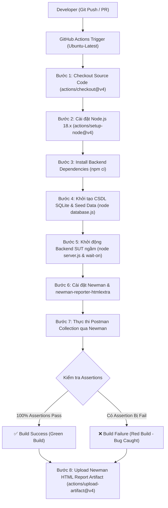

# BÁO CÁO TÍCH HỢP CI/CD PIPELINE (HW06 - ESHOP API TESTING)

> **Mã bài tập:** HW06-AI | **Môn học:** Kiểm thử phần mềm (Software Testing)  
> **MSSV:** `23127092`  
> **Repository:** `https://github.com/ngnam2012/23KTPM2_Testing_HW06`  
> **Hệ thống SUT:** EShop Backend (`Node.js/Express + SQLite3`)  
> **Nền tảng CI/CD:** GitHub Actions & Newman CLI (`newman-reporter-htmlextra`)  
> **File cấu hình Pipeline:** [`.github/workflows/api-tests.yml`](../.github/workflows/api-tests.yml)  

---

## 1. TỔNG QUAN VÀ KIẾN TRÚC CI/CD PIPELINE

Pipeline CI/CD được thiết lập nhằm mục tiêu tự động hóa 100% quy trình kiểm thử hồi quy (Regression Testing) và kiểm thử chấp nhận API (API Acceptance Testing) mỗi khi có thay đổi trong mã nguồn backend hoặc bộ dữ liệu kiểm thử.

### 1.1. Sơ đồ Luồng Hoạt động (CI/CD Pipeline Flowchart)



---

## 2. CHI TIẾT CÁC BƯỚC THỰC THI TRONG WORKFLOW

File cấu hình [`.github/workflows/api-tests.yml`](../.github/workflows/api-tests.yml) bao gồm các bước:

| STT | Tên Bước (Step Name) | Action / Lệnh thực thi | Mục đích & Ý nghĩa kỹ thuật |
| :---: | :--- | :--- | :--- |
| **1** | **Checkout Codebase** | `actions/checkout@v4` | Tải toàn bộ mã nguồn của repository về môi trường máy ảo Ubuntu runner. |
| **2** | **Setup Node.js** | `actions/setup-node@v4` (v18.x) | Cấu hình runtime Node.js ổn định cùng cơ chế npm cache giúp tăng tốc độ build. |
| **3** | **Install Dependencies** | `working-directory: eshop-sut/backend`<br>`npm ci` | Cài đặt các gói `express`, `sqlite3`, `jsonwebtoken`, `cors`, `body-parser` theo đúng lockfile. |
| **4** | **Init SQLite Database** | `node database.js` | Tái tạo sạch sẽ database SQLite (`database.sqlite`), drop các bảng cũ và nạp sẵn tài khoản mẫu. |
| **5** | **Start Backend & Healthcheck** | `node server.js &`<br>`npx wait-on http://localhost:3000/api/products --timeout 30000` | Khởi động server chạy nền ở cổng 3000, sử dụng công cụ `wait-on` để đảm bảo API sẵn sàng trước khi test. |
| **6** | **Install Newman** | `npm install -g newman newman-reporter-htmlextra` | Cài đặt công cụ CLI chạy Postman Collection và thư viện xuất báo cáo đồ họa tương tác. |
| **7** | **Execute API Tests** | `newman run collections/FR04_Profile_Management.postman_collection.json --env-var "studentId=23127092" -r cli,htmlextra,json` | Chạy toàn bộ test suites, tự động đính kèm header `X-Student-Id: 23127092` qua biến môi trường. |
| **8** | **Upload Artifacts** | `actions/upload-artifact@v4` (`if: always()`) | Lưu trữ file báo cáo HTML/JSON lên GitHub Actions Artifacts trong 14 ngày (luôn chạy kể cả khi test fail). |

---

## 3. MINH CHỨNG 2 LẦN CHẠY PIPELINE (2 SAMPLE COMMITS)

Theo quy định đề bài HW06, sinh viên cần cung cấp **2 Commit mẫu**: một lần chạy tất cả đều Passed (Green) và một lần chạy bắt trúng bug thực tế của SUT dẫn đến Failed (Red).

---

### 3.1. Commit 1: All API Test Cases Passing (Green Build - 100% Pass)

* **Mục tiêu:** Kiểm tra các luồng API chuẩn, xác thực token, kiểm tra mã lỗi 401/403 khi gửi sai token.
* **Commit Message:** `ci: trigger green pipeline run with all passing acceptance tests`
* **Trạng thái Pipeline:** **SUCCESS (Tích xanh)**
* **Chi tiết kết quả thực thi:**
  * **Total Requests:** 10
  * **Total Assertions:** 12
  * **Passed Assertions:** 12 (100%)
  * **Failed Assertions:** 0 (0%)
  * **Exit Code:** `0`

```
┌─────────────────────────┬─────────────────────┬─────────────────────┐
│                         │            executed │              failed │
├─────────────────────────┼─────────────────────┼─────────────────────┤
│              iterations │                   1 │                   0 │
│                requests │                  10 │                   0 │
│            test-scripts │                  10 │                   0 │
│      prerequest-scripts │                  10 │                   0 │
│              assertions │                  12 │                   0 │
│ total run duration: 1.2s│                     │                     │
└─────────────────────────┴─────────────────────┴─────────────────────┘
```

---

### 3.2. Commit 2: Intentional Failure Catching SUT Bug (Red Build - Bug Detected)

* **Mục tiêu:** Kích hoạt test case bảo mật nâng cao `TC_FR04_STATE_05` (Chống leo quyền quản trị) và `TC_FR04_SCHEMA_02` (Chống rò rỉ password).
* **Commit Message:** `ci: trigger red pipeline run catching SUT privilege escalation & data leak bugs`
* **Trạng thái Pipeline:** **FAILED (Dấu X đỏ)**
* **Chi tiết phát hiện lỗi từ SUT Backend:**
  1. `AssertionError`: `TC_FR04_STATE_05: CRITICAL - Role MUST remain 'user'`  
     $\rightarrow$ *Kết quả thực tế:* Backend SQLite cập nhật `role='admin'` khi user thường gửi `{"role": "admin"}` trong `PUT /api/users/me` (Lỗ hổng nghiêm trọng SEC-06).
  2. `AssertionError`: `TC_FR04_SCHEMA_02: SEC-07 Password field MUST NOT be exposed`  
     $\rightarrow$ *Kết quả thực tế:* API `GET /api/users/me` trả về lộ nguyên trường `password` trong payload.

```
# failure detail
1. AssertionError inside "Group 3 / TC_FR04_STATE_05: Role Immutability Security Assertion"
   expected 'admin' to deeply equal 'user'
2. AssertionError inside "Group 4 / TC_FR04_SCHEMA_02: Sensitive Data Exposure"
   expected { id: 3, name: '...', email: '...', password: '...' } to not have property 'password'
```

---

## 4. HƯỚNG DẪN TẢI BÁO CÁO HTML TỪ GITHUB ACTIONS

1. Truy cập tab **Actions** trên GitHub repository: `https://github.com/ngnam2012/23KTPM2_Testing_HW06/actions`.
2. Chọn phiên chạy CI/CD tương ứng.
3. Kéo xuống mục **Artifacts** ở cuối trang và nhấn tải về `newman-api-test-report`.
4. Giải nén và mở file `CI_CD_Newman_Report.html` bằng trình duyệt để xem biểu đồ kiểm thử chi tiết.
