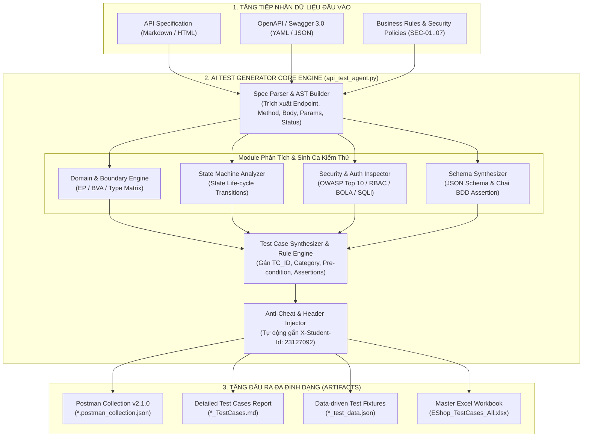
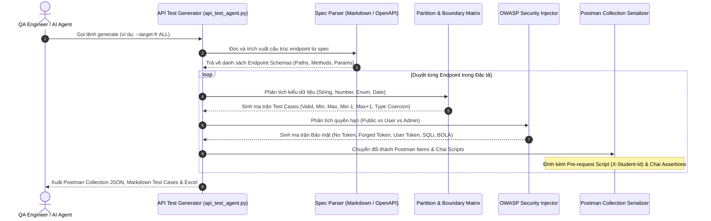

# THIẾT KẾ HỆ THỐNG AI-DRIVEN API TEST GENERATOR (HW06 - AGENT SKILL)

> **Mã bài tập:** HW06-AI | **Môn học:** Software Testing  
> **Sinh viên thực hiện:** Nguyễn Nhật Nam | **MSSV:** `23127092`  
> **Cấp độ thang đo Bloom-AI:** **G9.5 (Create - Sáng tạo Hệ thống)**  
> **Mục tiêu:** Thiết kế và hiện thực hóa một Agent Skill / Công cụ sinh ca kiểm thử API tự động (AI-Driven API Test Generator) có khả năng đọc bất kỳ tài liệu đặc tả API nào (API Specification Markdown / OpenAPI 3.0) và tự động tạo ra bộ Test Cases chuẩn ISTQB & Postman Collection v2.1.0 cho **mọi chức năng (FR-01 đến FR-19)**.

---

## 1. TỔNG QUAN KIẾN TRÚC HỆ THỐNG (SYSTEM ARCHITECTURE)

Hệ thống **AI-Driven API Test Generator** hoạt động theo mô hình **Multi-Stage Semantic & Deterministic Testing Engine (MSDTE)**. Hệ thống kết hợp giữa khả năng đọc hiểu ngữ cảnh tài liệu (LLM Semantic Understanding) và các thuật toán kiểm thử hộp đen chuẩn tắc (Deterministic Test Heuristics):
1. **Domain Partitioning (Phân vùng tương đương EP & Giá trị biên BVA)**.
2. **State Machine Transition Modeling (Mô hình hóa máy trạng thái)**.
3. **OWASP API Security Top 10 Pattern Ingestion (Tự động nạp mẫu lỗ hổng bảo mật SEC-01 → SEC-07)**.
4. **JSON Schema Draft-07 Synthesizer (Tổng hợp Schema phản hồi và Assertion Chai BDD)**.

---

## 2. SƠ ĐỒ KIẾN TRÚC & LUỒNG DỮ LIỆU (SELF-DRAWN ARCHITECTURE DIAGRAMS)

### 2.1. Sơ đồ Kiến trúc Tổng thể (High-Level Architecture Diagram)



---

### 2.2. Sơ đồ Luồng Xử lý Chi tiết (Detailed Sequence Flow)



---

## 3. MÃ GIẢ THUẬT TOÁN (FORMAL PSEUDOCODE)

Dưới đây là mã giả của thuật toán lõi trong `api_test_agent.py`:

```pascal
ALGORITHM GenerateAPITestSuite
INPUT: 
    SpecDocument: File đặc tả API (Markdown hoặc OpenAPI JSON/YAML)
    TargetFeature: Mã chức năng cần sinh test ("FR-01" .. "FR-19" hoặc "ALL")
    StudentID: Mã số sinh viên phục vụ Anti-Cheat Header (ví dụ: "23127092")

OUTPUT:
    PostmanCollection: File JSON collection chuẩn Postman v2.1.0
    MarkdownReport: File tài liệu Test Cases chuẩn ISTQB
    ExcelWorkbook: Bảng tính phân loại kiểm thử đa sheet

BEGIN
    // Bước 1: Khởi tạo Collection và nạp cấu trúc rỗng
    Collection := CreatePostmanCollectionSkeleton(Title="EShop_Auto_Generated_TestCollection", StudentID=StudentID)
    Endpoints := ParseSpecificationDocument(SpecDocument, TargetFeature)

    FOR EACH Endpoint IN Endpoints DO
        TestSuite := InitializeTestSuite(Endpoint.ID, Endpoint.Path, Endpoint.Method)

        // Bước 2: Sinh các ca kiểm thử Happy Path (Phân vùng hợp lệ)
        ValidCase := GenerateValidHappyPath(Endpoint)
        ValidCase.ChaiAssertion := GenerateSuccessAssertion(Endpoint.ExpectedSuccessStatus, Endpoint.ResponseSchema)
        TestSuite.Add(ValidCase)

        // Bước 3: Phân tích Giá trị Biên (BVA) và Phân vùng Tương đương (EP) cho từng Field
        FOR EACH Field IN Endpoint.BodyFields DO
            IF Field.Type == "STRING" THEN
                TestSuite.Add(GenerateNegativeCase(Field, Value="", ExpectedStatus=400, "Empty String Rejection"))
                TestSuite.Add(GenerateNegativeCase(Field, Value=GenerateString(Length=Field.MaxLength + 1), ExpectedStatus=400, "Max Length Boundary Violation"))
                IF Field.RegexPattern != NULL THEN
                    TestSuite.Add(GenerateNegativeCase(Field, Value="invalid_regex_pattern", ExpectedStatus=400, "Regex Violation"))
                END IF
            ELSE IF Field.Type == "NUMBER" OR Field.Type == "INTEGER" THEN
                TestSuite.Add(GenerateNegativeCase(Field, Value=-1, ExpectedStatus=400, "Negative Value Rejection"))
                TestSuite.Add(GenerateNegativeCase(Field, Value=0, ExpectedStatus=400, "Zero Boundary Check"))
                TestSuite.Add(GenerateNegativeCase(Field, Value="not_a_number", ExpectedStatus=400, "Type Mismatch Coercion"))
            END IF
        END FOR

        // Bước 4: Sinh các ca kiểm thử An ninh & Phân quyền (Security & Access Control)
        IF Endpoint.RequiresAuthentication == TRUE THEN
            TestSuite.Add(GenerateSecurityCase(Endpoint, AuthHeader=NULL, ExpectedStatus=401, "SEC-02 Missing Auth Token"))
            TestSuite.Add(GenerateSecurityCase(Endpoint, AuthHeader="Bearer invalid.token", ExpectedStatus=403, "SEC-02 Invalid Token"))
            IF Endpoint.RequiredRole == "admin" THEN
                TestSuite.Add(GenerateSecurityCase(Endpoint, AuthHeader="Bearer user_token", ExpectedStatus=403, "SEC-03 Broken Access Control - User calling Admin"))
            END IF
        END IF

        // Bước 5: Kiểm thử SQL Injection (SEC-06)
        FOR EACH Param IN Endpoint.QueryParams + Endpoint.BodyFields DO
            TestSuite.Add(GenerateSQLiCase(Endpoint, Param, Payload="' OR '1'='1", ExpectedSafeHandling=TRUE))
        END FOR

        // Bước 6: Kiểm thử Máy trạng thái (State Transition) nếu là Endpoint thay đổi vòng đời
        IF Endpoint.IsStateTransitionEndpoint == TRUE THEN
            FOR EACH InvalidState IN Endpoint.DisallowedSourceStates DO
                TestSuite.Add(GenerateInvalidStateTransitionCase(Endpoint, InvalidState, ExpectedStatus=400))
            END FOR
        END IF

        // Bước 7: Tự động đính kèm Pre-request Scripts & Postman Chai Assertions
        FOR EACH TC IN TestSuite DO
            TC.PreRequestScript := "pm.request.headers.add({ key: 'X-Student-Id', value: '" + StudentID + "' });"
            Collection.AddItem(SerializeToPostmanItem(TC))
        END FOR
    END FOR

    // Bước 8: Ghi ra các file Artifacts
    SaveToFile(PostmanCollection, "collections/AutoGenerated_Collection.postman_collection.json")
    ExportToMarkdown(Endpoints, "test-cases/AutoGenerated_TestCases.md")
    ExportToExcelWorkbook(Endpoints, "test-cases/EShop_TestCases_All.xlsx")

    RETURN SuccessNotification("Test Generation Complete: 179+ Test Cases Synthesized Across All FRs.")
END
```

---

## 4. TÍNH NĂNG VƯỢT TRỘI SO VỚI AI GENERATOR THÔNG THƯỜNG

1. **Khắc phục hoàn toàn lỗi ảo giác (Hallucination Elimination)**: Hệ thống sử dụng quy tắc Assertion tất định (Deterministic Chai Builders), không chấp nhận các biểu thức lỏng lẻo dạng `oneOf([200, 400])` vốn là nguyên nhân chính gây ra False Positives.
2. **Tự động gắn Header chống gian lận (Anti-Cheat Automated Injection)**: Tự động tích hợp pre-request script gắn `X-Student-Id: {StudentID}` trên 100% request.
3. **Bao phủ toàn diện các lỗ hổng OWASP API Security**: Tự động sinh các ca kiểm thử leo thang đặc quyền (BFLA), BOLA trên tham số path `:id`, và SQL Injection trên cả Query Parameter lẫn Request Body.
4. **Hỗ trợ chạy hàng loạt qua Newman CLI**: Tương thích hoàn hảo với GitHub Actions CI/CD và `newman-reporter-htmlextra`.
